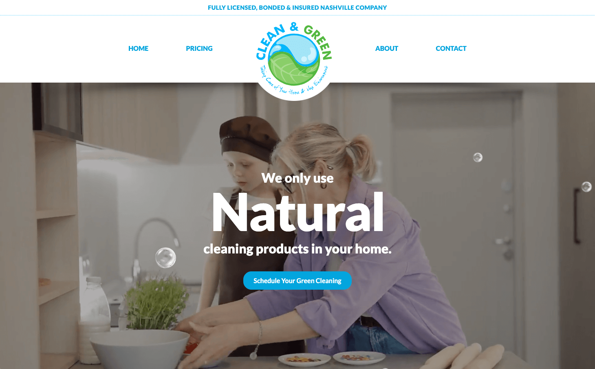

# Clean & Green

A Nashville Green Cleaning Company

---

Visit Clean & Green: [https://brandicameron.github.io/cg/](https://brandicameron.github.io/cg/)

---

## Description

Sometimes service business sites can be, well, a bit boring — but we added a bit of whimsy with this one. Please enjoy the floating cleaning bubbles as you scroll & explore all the exceptional cleaning packages this company has to offer.

---

## Things Learned:

- This was the first project I used Sass on.
- This was the project where I learned that I don't care for nesting in Sass — it encouraged me to be lazy and nest instead of creating explicit classes. Had to nip that in the bud.

---

## Credits

Thanks to [Snorkl.tv, aka Carl Schooff](https://www.snorkl.tv/) for his wonderful Greensock/GSAP tutorials. Also for his [codepen](https://codepen.io/snorkltv/pen/abddMGd) which became the template for the bubble effect in this site.
